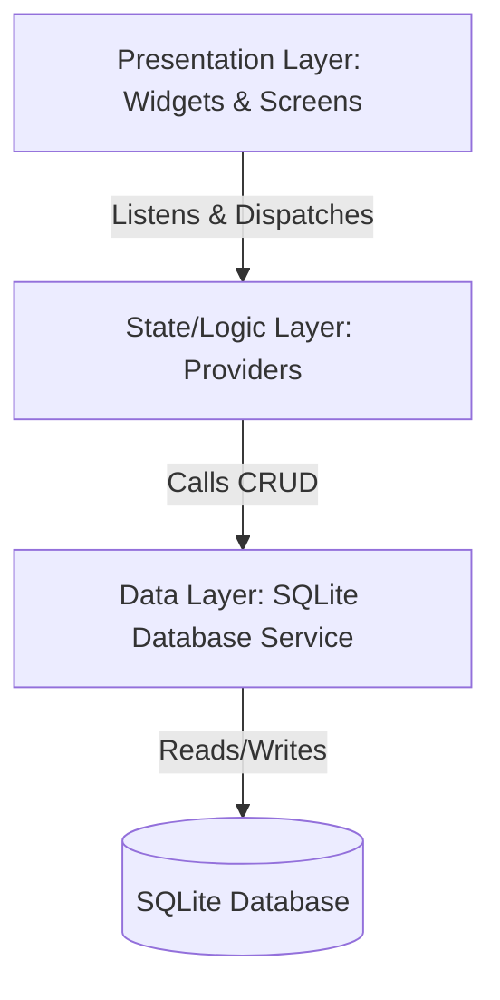

# System Architecture - Offline Order Management System

This document outlines the architecture of the **Offline Flutter Order Management System**, built for merchants transitioning from manual pen-and-paper tracking to a premium offline desktop application.

## Key Design Principles

1. **Local-First & Offline-Only**: The application is 100% self-contained. It operates directly on the native host system without requiring an active internet connection. All data is persisted in a local database.
2. **Layered Separation of Concerns**:
   * **Data Layer**: Handles SQLite database operations, queries, migrations, and low-level data mapping.
   * **State/Logic Layer**: Orchestrates state using clean, simple providers (`ChangeNotifier` and `ValueNotifier`) for reactive UI updates without complex boilerplate.
   * **Presentation Layer**: Built with premium, rich modern aesthetics (dark/light theme config, high-contrast visual tokens, responsive widgets) tailored for desktop resolutions.
3. **Multi-File & Modular Development**: To maintain clean code and readability, files are strictly split into distinct folders and purposes.

---

## High-Level Architecture Diagram



---

## Folder Structure

The code is modularly structured under `/lib` as follows:

```text
lib/
├── main.dart                      # App entrypoint, theme initialization, and provider setup
├── core/
│   ├── theme/
│   │   ├── colors.dart            # Harmonious HSL-derived colors, gradient tokens
│   │   └── style.dart             # Custom fonts, typography, margins, glassmorphic card designs
│   └── utils/
│       └── helpers.dart           # Currency formatting, date parsing, input validation
├── data/
│   ├── database/
│   │   ├── database_service.dart  # SQLite lifecycle and database connection managers
│   │   └── tables.dart            # SQL Table definitions and schema versions
│   ├── models/
│   │   ├── user_model.dart        # Account and login models
│   │   ├── product_model.dart     # Product info models
│   │   └── order_model.dart       # Order tracking models
│   └── repository/
│       ├── user_repository.dart   # DB queries for master account and pins
│       ├── product_repository.dart# DB queries for inventory & pricing
│       └── order_repository.dart  # DB queries for customer order calculations
├── providers/
│   ├── auth_provider.dart         # Authentication & setup session state
│   ├── product_provider.dart      # Product inventory reactivity
│   └── order_provider.dart        # Customer order tracking reactivity
└── presentation/
    ├── screens/
    │   ├── setup/
    │   │   ├── setup_admin_screen.dart    # First-time master account wizard
    │   │   └── setup_products_screen.dart # Initial product loading screen
    │   ├── login_screen.dart              # Secure screen for PIN or Password entry
    │   ├── dashboard_screen.dart          # Beautiful sales statistics and visual charts
    │   ├── order_entry_screen.dart        # Advanced customer order receipt form
    │   ├── orders_list_screen.dart        # Comprehensive filterable order table
    │   └── products_list_screen.dart      # Interactive inventory management panel
    └── widgets/
        ├── navigation_sidebar.dart        # Premium glassmorphic side-nav
        ├── glass_card.dart                # Elegant visual cards with subtle shadows
        └── custom_text_field.dart         # Consistent input styling with micro-animations
```

---

## Component Separation Details

### 1. Presentation (UI)
* Built using **Material 3** guidelines, enhanced with vibrant modern typography (such as `Outfit` or `Inter`) and gradients.
* Screens are fully responsive, optimized for horizontal split screens (desktop) while remaining compact and user-friendly.
* Placeholders are absolutely forbidden. Where charts or lists are rendered, realistic sample or real DB records are loaded.

### 2. State Management (Providers)
* **`AuthProvider`**: Controls whether the application is in first-time setup, locked/login, or fully logged-in state.
* **`ProductProvider`**: Manages the reactive state of the inventory, notifying order creation views when stock or prices change.
* **`OrderProvider`**: Manages the active orders, automatically updating metrics, calculating totals, and refreshing the order log view.

### 3. Data Persistence (SQLite)
* Employs the `sqflite` framework with `sqflite_common_ffi` on macOS to bind to the native system-level SQLite engine.
* Safe and transactional query executions prevent corrupted data on abrupt system shutdowns.
* Automatic data formatting, such as password hashes and JSON-encoded custom product columns.
