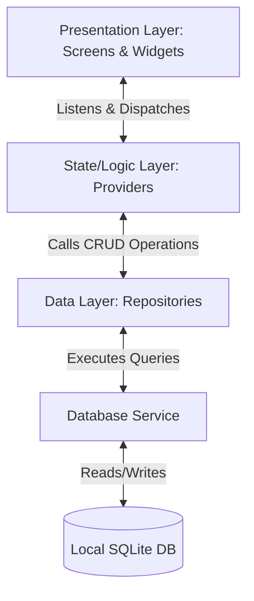

# Codebase Blueprint: OrderFlow Offline Management System

This document is the **Single Source of Truth** for the architecture, file organization, database schema, state management, and design tokens of the OrderFlow Offline Flutter application. 

Always consult this blueprint before proposing, analyzing, or making any changes to the codebase.

---

## 1. System Architecture & Core Concepts

The application is built on a **Layered Separation of Concerns** design pattern:



### Core Architecture Rules:
1. **Offline-First & Local-Only**: 100% self-contained. All state persists in the local SQLite database.
2. **Modular File-Split Design**: Do not write monster files. Split screens, models, controllers, and services into dedicated single-purpose files.
3. **Reactive Binding**: Presentation files NEVER talk to the Database directly. They dispatch actions via **ChangeNotifier Providers**, which trigger **Repositories**, which in turn execute queries against the **Database Service**.

---

## 2. File and Directory Map (`/lib`)

This section details every file inside the core `lib/` directory and its technical responsibility.

### Root
* [main.dart](file:///Users/michaeljosephsantos/Desktop/personal-projects/project-2/lib/main.dart) - App entry point. Handles engine bindings initialization, sets platform-specific SQLite factory drivers (WASM for Chrome vs. FFI for Desktop), initializes global MultiProvider, sets up MaterialApp ThemeData, and handles root routing using the `AuthRouteGuard`.

### Core Layer (`lib/core/`)
Contains style configurations, theme palettes, helper classes, and system-wide utilities.
* [core/theme/colors.dart](file:///Users/michaeljosephsantos/Desktop/personal-projects/project-2/lib/core/theme/colors.dart) - Curated, slate-base modern palette. High-contrast Slate primary, Teal & Emerald brand accents, status colors (success, warning, error), text colors, and premium linear/card gradients.
* [core/theme/style.dart](file:///Users/michaeljosephsantos/Desktop/personal-projects/project-2/lib/core/theme/style.dart) - Layout design tokens. Precise micro-radii (`radiusSmall: 4.0`, `radiusMedium: 6.0`, `radiusLarge: 8.0`), technical shadows, typography specifications (`Outfit`/`Inter` fonts, letter spacings), custom text field input decorations, and minimalist thin-bordered glass-card decorations.
* [core/utils/helpers.dart](file:///Users/michaeljosephsantos/Desktop/personal-projects/project-2/lib/core/utils/helpers.dart) - Helper functions. Currency formatting (`formatCurrency` returning Philippine Peso symbol `₱`), dates formatting (`formatTimestamp`), cryptography (`hashSha256` hashing), inputs validators (`isValidString`), and pure-Dart memory ZIP compressing and extracting (`createBackupZip`, `extractDbFromZip`).
* [core/utils/save_helper_stub.dart](file:///Users/michaeljosephsantos/Desktop/personal-projects/project-2/lib/core/utils/save_helper_stub.dart) - Abstract interface contract defining cross-platform file saving mechanisms.
* [core/utils/save_helper_web.dart](file:///Users/michaeljosephsantos/Desktop/personal-projects/project-2/lib/core/utils/save_helper_web.dart) - Web-specific file download implementation utilizing raw Blob and programmatically clicked Anchor elements in Chrome.
* [core/utils/save_helper_desktop.dart](file:///Users/michaeljosephsantos/Desktop/personal-projects/project-2/lib/core/utils/save_helper_desktop.dart) - Desktop-specific implementation utilizing FilePicker native "Save As" overlays and standard dart:io system file writer streams.

### Data Layer (`lib/data/`)
Responsible for persistence, database management, and SQL interaction.
* [data/database/database_service.dart](file:///Users/michaeljosephsantos/Desktop/personal-projects/project-2/lib/data/database/database_service.dart) - Singleton database controller. Coordinates SQLite database initialization, configurations (enforcing `PRAGMA foreign_keys = ON`), schema creation (`_onCreate`), version transitions (`_onUpgrade` for adding merchant custom branding), safe transactions, database connections, and clear-down reset operations (`clearAllData`).
* [data/models/user_model.dart](file:///Users/michaeljosephsantos/Desktop/personal-projects/project-2/lib/data/models/user_model.dart) - Administrative credential model mapping rows to/from user attributes (`id`, `username`, `authType` (PASSWORD or PIN), `passwordHash`, `pinHash`, `createdAt`).
* [data/models/product_model.dart](file:///Users/michaeljosephsantos/Desktop/personal-projects/project-2/lib/data/models/product_model.dart) - Inventory item model. Includes dynamic custom attribute columns map (`extraColumns`) serialized to/from JSON strings in the database table.
* [data/models/order_model.dart](file:///Users/michaeljosephsantos/Desktop/personal-projects/project-2/lib/data/models/order_model.dart) - Transaction ledger entry model. Tracks transaction elements, auto-calculates total prices, and handles joint SQL queries containing joined product attributes (`productName`).
* [data/models/merchant_model.dart](file:///Users/michaeljosephsantos/Desktop/personal-projects/project-2/lib/data/models/merchant_model.dart) - Store configurations model representing white-label branding variables. Map codenames (e.g. `FLAME`, `GAS`, `STORE`, `BAG`) directly to beautiful Material design icons.
* [data/repository/user_repository.dart](file:///Users/michaeljosephsantos/Desktop/personal-projects/project-2/lib/data/repository/user_repository.dart) - SQLite query interface for administrative credentials. Manages password/PIN checks, master account creation, and validation checks.
* [data/repository/product_repository.dart](file:///Users/michaeljosephsantos/Desktop/personal-projects/project-2/lib/data/repository/product_repository.dart) - SQLite query interface for products. Executes inserts, updates, deletes, and fetch operations. Automatically extracts and populates unique custom property keys into the `product_property_keys` lookup table to drive suggestions.
* [data/repository/order_repository.dart](file:///Users/michaeljosephsantos/Desktop/personal-projects/project-2/lib/data/repository/order_repository.dart) - SQLite query interface for orders. Handles critical transactional operations (e.g., placing an order with rigorous database-level stock validation checks, and restocking on cancellation). Includes complex dashboard aggregation queries.

### Providers Layer (`lib/providers/`)
Reactivity handlers acting as the State Management controllers using ChangeNotifier.
* [providers/auth_provider.dart](file:///Users/michaeljosephsantos/Desktop/personal-projects/project-2/lib/providers/auth_provider.dart) - Tracks user state through `AuthStatus` enum (`loading`, `unregistered`, `unauthenticated`, `authenticated`). Restricts access using guards and enforces premium 3-second splash screens for branding reinforcement.
* [providers/product_provider.dart](file:///Users/michaeljosephsantos/Desktop/personal-projects/project-2/lib/providers/product_provider.dart) - Manages live inventory queries, CRUD actions, search filters, and reactive notification bindings. Exposes reactive cache lists of uniquely harvested custom property keys for interactive autocomplete.
* [providers/order_provider.dart](file:///Users/michaeljosephsantos/Desktop/personal-projects/project-2/lib/providers/order_provider.dart) - Handles customer checkout actions, order ledger tables, statuses modifications, and real-time dashboard analytics counters.
* [providers/merchant_provider.dart](file:///Users/michaeljosephsantos/Desktop/personal-projects/project-2/lib/providers/merchant_provider.dart) - Keeps white-label branding configurations reactive, allowing real-time changes to the title, taglines, and icons across the entire platform.
* [providers/backup_provider.dart](file:///Users/michaeljosephsantos/Desktop/personal-projects/project-2/lib/providers/backup_provider.dart) - Coordinates state and triggers for memory compression and cross-platform file picking/saving configurations.

### Presentation Layer (`lib/presentation/`)
Divided into global screens (panels representing single workflows) and reusable customized widgets.
* **Screens (`lib/presentation/screens/`)**
  - [setup/setup_branding_screen.dart](file:///Users/michaeljosephsantos/Desktop/personal-projects/project-2/lib/presentation/screens/setup/setup_branding_screen.dart) - Stage 1 of Onboarding. Customizes merchant store name, tagline, and emblem in a premium animated interface.
  - [setup/setup_admin_screen.dart](file:///Users/michaeljosephsantos/Desktop/personal-projects/project-2/lib/presentation/screens/setup/setup_admin_screen.dart) - Stage 2 of Onboarding. Sets up master administrator login credentials using secure multi-mode switches (Password vs. PIN).
  - [setup/setup_products_screen.dart](file:///Users/michaeljosephsantos/Desktop/personal-projects/project-2/lib/presentation/screens/setup/setup_products_screen.dart) - Stage 3 of Onboarding. Pre-loads products catalogue directly into database memory.
  - [login_screen.dart](file:///Users/michaeljosephsantos/Desktop/personal-projects/project-2/lib/presentation/screens/login_screen.dart) - Secure portal checking hashed security keys. Adapts to Password vs. PIN dynamic fields seamlessly.
  - [dashboard_screen.dart](file:///Users/michaeljosephsantos/Desktop/personal-projects/project-2/lib/presentation/screens/dashboard_screen.dart) - Home viewport. Displays professional slate charts, metric progress bars, top products tables, and aggregate data counters. Features a responsive greetings and database connection status banner that auto-adjusts on mobile to prevent layouts overflows.
  - [order_entry_screen.dart](file:///Users/michaeljosephsantos/Desktop/personal-projects/project-2/lib/presentation/screens/order_entry_screen.dart) - Point of Sale checkout form. Calculates computed price in real-time, displays live stock indicator pills, validates constraints, and adapts to mobile devices with adaptive viewport padding, a horizontal-wrapping checkout status layout, and column-stacking fulfillment selectors.
  - [orders_list_screen.dart](file:///Users/michaeljosephsantos/Desktop/personal-projects/project-2/lib/presentation/screens/orders_list_screen.dart) - Sales transaction tracker. Dynamically shifts from an 8-column desktop database grid to beautiful mobile-tailored status cards with integrated direct-tap action controls and horizontally scrollable chip filters.
  - [products_list_screen.dart](file:///Users/michaeljosephsantos/Desktop/personal-projects/project-2/lib/presentation/screens/products_list_screen.dart) - Inventory command panel. Automatically reconfigures to mobile-friendly stacked header alignments and tactile, border-separated stock health cards.
  - [brand_settings_screen.dart](file:///Users/michaeljosephsantos/Desktop/personal-projects/project-2/lib/presentation/screens/brand_settings_screen.dart) - White-label branding control dashboard. Lets users change their store identity in real-time.
* **Widgets (`lib/presentation/widgets/`)**
  - [presentation/widgets/navigation_sidebar.dart](file:///Users/michaeljosephsantos/Desktop/personal-projects/project-2/lib/presentation/widgets/navigation_sidebar.dart) - Modern glassmorphic left-dock desktop sidebar navigation. Includes current merchant brand indicators, user credentials badges, and transition items.
  - [presentation/widgets/app_preloading_screen.dart](file:///Users/michaeljosephsantos/Desktop/personal-projects/project-2/lib/presentation/widgets/app_preloading_screen.dart) - Dynamic splash intro enforcing visual brand identity.
  - [presentation/widgets/glass_card.dart](file:///Users/michaeljosephsantos/Desktop/personal-projects/project-2/lib/presentation/widgets/glass_card.dart) - Minimalist card container wrapping components with high-fidelity borders and flat depth shadows.
  - [presentation/widgets/custom_text_field.dart](file:///Users/michaeljosephsantos/Desktop/personal-projects/project-2/lib/presentation/widgets/custom_text_field.dart) - Custom stylized fields implementing smooth validation and micro-animations.

---

## 3. Database Schema & Core Tables

Enforced in [database_service.dart](file:///Users/michaeljosephsantos/Desktop/personal-projects/project-2/lib/data/database/database_service.dart):
* Native **Foreign Keys constraint** is explicitly configured on startup using `PRAGMA foreign_keys = ON;`.
* Table schema definitions are:

### `users`
Tracks master administrator account security.
```sql
CREATE TABLE users (
  id INTEGER PRIMARY KEY AUTOINCREMENT,
  username TEXT NOT NULL UNIQUE,
  auth_type TEXT NOT NULL,       -- 'PIN' or 'PASSWORD'
  password_hash TEXT,            -- SHA-256 string, null if auth_type is PIN
  pin_hash TEXT,                 -- SHA-256 string, null if auth_type is PASSWORD
  created_at TEXT NOT NULL       -- ISO-8601 string
);
```

### `products`
The inventory catalog. Supports dynamic custom attribute columns.
```sql
CREATE TABLE products (
  id INTEGER PRIMARY KEY AUTOINCREMENT,
  name TEXT NOT NULL UNIQUE,
  unit_cost REAL NOT NULL,
  selling_price REAL NOT NULL,
  quantity INTEGER NOT NULL DEFAULT 1,
  extra_columns_json TEXT,       -- Serialized JSON map for custom tags
  created_at TEXT NOT NULL       -- ISO-8601 string
);
```

### `orders`
The sales ledger database. Captures customer profiles and transaction-level grand totals.
```sql
CREATE TABLE orders (
  id INTEGER PRIMARY KEY AUTOINCREMENT,
  customer_name TEXT NOT NULL,
  customer_address TEXT NOT NULL,
  fulfillment_type TEXT NOT NULL,-- 'DELIVERY' or 'WALKIN'
  delivery_rider TEXT,           -- Optional string
  status TEXT NOT NULL DEFAULT 'PENDING', -- 'PENDING', 'COMPLETED', 'CANCELLED'
  total_price REAL NOT NULL DEFAULT 0.0,  -- Sum of all order item subtotals
  created_at TEXT NOT NULL       -- ISO-8601 string
);
```

### `order_items`
Holds line items purchased inside an order, snapping the current unit_price at checkout.
```sql
CREATE TABLE order_items (
  id INTEGER PRIMARY KEY AUTOINCREMENT,
  order_id INTEGER NOT NULL,
  product_id INTEGER NOT NULL,
  quantity INTEGER NOT NULL,
  unit_price REAL NOT NULL,
  computed_price REAL NOT NULL,  -- quantity * unit_price
  FOREIGN KEY (order_id) REFERENCES orders (id) ON DELETE CASCADE,
  FOREIGN KEY (product_id) REFERENCES products (id) ON DELETE RESTRICT
);
```

### `merchant_config`
Custom store white-label parameters. Supports real-time layout updates.
```sql
CREATE TABLE merchant_config (
  id INTEGER PRIMARY KEY AUTOINCREMENT,
  store_name TEXT NOT NULL,
  store_tagline TEXT NOT NULL,
  store_icon TEXT NOT NULL,      -- E.g. 'FLAME', 'STORE', 'BAG', 'CART', 'FOOD'
  updated_at TEXT NOT NULL       -- ISO-8601 string
);
```

### `product_property_keys`
Custom attributes lookup table. Caches all unique key names entered by the merchant for dynamic input suggestions.
```sql
CREATE TABLE product_property_keys (
  id INTEGER PRIMARY KEY AUTOINCREMENT,
  key_name TEXT NOT NULL UNIQUE
);
```

---

## 4. State Reactivity & Data Flow

```
   [User interacts with UI Widget]
                  │
                  ▼
   [Dispatches action on Provider Class]
                  │
                  ▼
   [Provider calls Repository Method]
                  │
                  ▼
   [Database executes SQL Transaction inside DatabaseService]
                  │
                  ▼
   [Provider fetches refreshed values from DB & updates fields]
                  │
                  ▼
   [Calls notifyListeners()]
                  │
                  ▼
   [Consumer widgets rebuild with premium animations]
```

### State Variables & Public APIs:

#### `BackupProvider`
* `isLoading`: Indicates active zip compress/extraction database file operations.
* `errorMessage`: Error string if a backup/restore cycle fails.
* `successMessage`: Successful backup export/import message.
* `exportBackup()`: Compresses the local database file into a ZIP archive and triggers system download/saves.
* `importBackup(onReloadAll)`: Triggers system file dialog picker, extracts SQLite database file, resets active connection, and reloads other provider tables.

#### `AuthProvider`
* `status`: Get current `AuthStatus`.
* `currentUser`: Get parsed `UserModel`.
* `loginError`: Return active string or null.
* `onboardingStep`: Get current onboarding setup progress step index (1, 2, or 3).
* `setOnboardingStep(step)`: Atomically updates onboarding screen progress and triggers layout transitions.
* `completeAdminSetup(username, credential, isPin)`: Registers master credentials and advances step.
* `login(username, credential, isPin)`: Authenticates user and flips status.
* `logout()`: Reset active session back to lock screen.
* `resetApplication()`: Drops all SQL tables and moves back to first-time onboarding.

#### `ProductProvider`
* `products`: Live list of parsed `ProductModel` items.
* `isLoading`: Boolean indicator.
* `loadProducts()`: Reloads catalog from DB.
* `addProduct(product)`: Inserts new product.
* `updateProduct(product)`: Modifies existing product values.
* `deleteProduct(id)`: Removes item.

#### `OrderProvider`
* `orders`: Comprehensive transactional list of orders.
* `totalRevenue`: Accumulator metric.
* `totalOrdersCount`: Counter metric.
* `pendingOrdersCount`: Filtered state counter.
* `topProducts`: Ranked analytical array.
* `createOrder(order, onStockUpdated)`: Places transaction order with rigorous database-level validation checks.
* `changeOrderStatus(id, newStatus, onStockUpdated)`: Safe transaction handling (such as auto-restocking on cancel).

---

## 5. Visual Styling Standards

The design matches high-end desktop visual software using tight, flat, and professional Swiss design cues:

| Design Property | Token / Rule | Description |
|---|---|---|
| **Primary Base** | `0xFF0F172A` | Deep Slate Navy base color |
| **Surface/Card** | `0xFF1E293B` | High contrast raised card panel color |
| **Accent Primary**| `0xFF0D9488` | Teal accenting (Growth, commerce) |
| **Accent Secondary**| `0xFF6366F1` | Indigo highlights (Branding indicators) |
| **Borders** | `1.0px solid 0xFF334155` | Hairline divisions mimicking high-end SaaS dashboards |
| **Corner Radius** | `4.0`, `6.0`, `8.0` pixels | Precise micro-radii avoiding generic bubbly designs |
| **Shadows** | `premiumShadow` | Ultra-precise flat offsets without blurry dark glows |

---

## 6. How to Use this Blueprint

When the user requests changes, bug fixes, or enhancements:
1. **Always refer to this blueprint** to locate the exact target file and its role in the system.
2. Ensure your proposed code modifications **respect the layered boundaries** (Presentation -> State Provider -> Repository -> SQLite DB).
3. Check and update the corresponding schemas, repositories, and models listed in Sections 2 and 3 if database entities are being extended.
4. If styling widgets, strictly use the pre-defined layout tokens and builders specified in [core/theme/style.dart](file:///Users/michaeljosephsantos/Desktop/personal-projects/project-2/lib/core/theme/style.dart).
