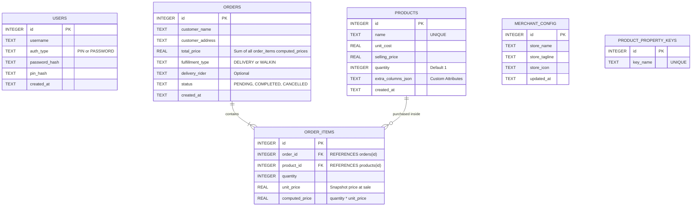

# Local Database Schema Design

This document details the SQLite database design for our offline Flutter Order Management application. The database is stored locally inside the host's standard storage directory via `path_provider`.

---

## Database Architecture Overview

The offline storage consists of six core tables:
1. `users`: Stores admin/master account credentials (PIN or Password hashes) and session settings.
2. `products`: Stores the merchant's custom inventory including unit costs, retail prices, stock quantity, and dynamically added column attributes.
3. `orders`: Tracks client sales transaction headers, capturing buyer profiles, grand total price-aggregations, fulfillment methods, and progress statuses.
4. `order_items`: Tracks discrete product lines purchased inside a given customer order, capturing stock snapshot prices.
5. `merchant_config`: Stores white-label settings allowing the system to dynamically brand itself on startup (Store Name, tagline, and chosen logo code).
6. `product_property_keys`: Lookup registry storing unique user-defined custom property key names (e.g. 'Size', 'Weight', 'Brand') to power autocomplete suggestions.

---

## Database Tables Specification

### 1. `users` Table
Stores authentication settings. Since this is an offline single-device setup, the first user created is labeled the default Administrator.

| Column Name | SQLite Data Type | Constraints | Description |
| :--- | :--- | :--- | :--- |
| `id` | `INTEGER` | `PRIMARY KEY AUTOINCREMENT` | Unique identifier for the account. |
| `username` | `TEXT` | `NOT NULL UNIQUE` | Unique username for authentication. |
| `auth_type` | `TEXT` | `NOT NULL` | Chosen login mode: `'PASSWORD'` or `'PIN'`. |
| `password_hash`| `TEXT` | `NULL` | SHA-256 hashed password string (if auth_type is PASSWORD). |
| `pin_hash` | `TEXT` | `NULL` | SHA-256 hashed 4-6 digit code string (if auth_type is PIN). |
| `created_at` | `TEXT` | `NOT NULL` | Standard ISO-8601 timestamp string (`YYYY-MM-DD HH:MM:SS`). |

---

### 2. `products` Table
Holds the item catalog. Custom user-defined columns (like "Weight", "Color", "Size") are safely stored inside a flexible structured JSON column `extra_columns_json`.

| Column Name | SQLite Data Type | Constraints | Description |
| :--- | :--- | :--- | :--- |
| `id` | `INTEGER` | `PRIMARY KEY AUTOINCREMENT` | Unique identifier for the product. |
| `name` | `TEXT` | `NOT NULL UNIQUE` | Human-readable name or model reference of the item. |
| `unit_cost` | `REAL` | `NOT NULL` | Wholesale / creation cost for merchant calculation. |
| `selling_price`| `REAL` | `NOT NULL` | Standard retail price charged to customers. |
| `quantity` | `INTEGER` | `NOT NULL DEFAULT 1` | Available stock amount (skippable, defaults to 1). |
| `extra_columns_json` | `TEXT` | `NULL` | JSON key-value string representing user's custom columns. |
| `created_at` | `TEXT` | `NOT NULL` | ISO-8601 creation timestamp. |

---

### 3. `orders` Table
Captures store order headers. The grand total price sums all linked order item lines, preserving accounting consistency.

| Column Name | SQLite Data Type | Constraints | Description |
| :--- | :--- | :--- | :--- |
| `id` | `INTEGER` | `PRIMARY KEY AUTOINCREMENT` | Unique transaction order tracking ID. |
| `customer_name`| `TEXT` | `NOT NULL` | Client's full name. |
| `customer_address`| `TEXT` | `NOT NULL` | Full delivery address (or Walk-in store marker). |
| `total_price` | `REAL` | `NOT NULL DEFAULT 0.0` | Billing total calculated as `SUM(order_items.computed_price)`. |
| `fulfillment_type`| `TEXT` | `NOT NULL` | Order distribution channel: `'DELIVERY'` or `'WALKIN'`. |
| `delivery_rider`| `TEXT` | `NULL` | Name/ID of the courier (optional). |
| `status` | `TEXT` | `NOT NULL DEFAULT 'PENDING'` | Operational state: `'PENDING'`, `'COMPLETED'`, or `'CANCELLED'`. |
| `created_at` | `TEXT` | `NOT NULL` | Transaction timestamp. |

---

### 4. `order_items` Table
Detailed breakdown of items purchased inside a sales transaction, decoupling products and orders for multi-item checkouts.

| Column Name | SQLite Data Type | Constraints | Description |
| :--- | :--- | :--- | :--- |
| `id` | `INTEGER` | `PRIMARY KEY AUTOINCREMENT` | Unique identifier for the line item. |
| `order_id` | `INTEGER` | `FOREIGN KEY REFERENCES orders(id) ON DELETE CASCADE` | Associated sales order ledger header. |
| `product_id` | `INTEGER` | `FOREIGN KEY REFERENCES products(id) ON DELETE RESTRICT` | Associated product inventory record. |
| `quantity` | `INTEGER` | `NOT NULL` | Quantity of items bought. |
| `unit_price` | `REAL` | `NOT NULL` | Snapshot of product selling price at checkout time. |
| `computed_price`| `REAL` | `NOT NULL` | Line total computed as `quantity * unit_price`. |

---

### 5. `merchant_config` Table
Houses dynamic merchant-specific branding configs to support full white-label distribution.

| Column Name | SQLite Data Type | Constraints | Description |
| :--- | :--- | :--- | :--- |
| `id` | `INTEGER` | `PRIMARY KEY AUTOINCREMENT` | Unique row identifier. |
| `store_name` | `TEXT` | `NOT NULL` | Customized store brand name. |
| `store_tagline` | `TEXT` | `NOT NULL` | Customized brand tagline or operational subtitle. |
| `store_icon` | `TEXT` | `NOT NULL` | Coded label representing standard brand emblems (e.g. `'GAS'`, `'BAG'`, `'CART'`). |
| `updated_at` | `TEXT` | `NOT NULL` | Standard ISO-8601 timestamp tracking when settings changed. |

---

### 6. `product_property_keys` Table
Lookup registry storing unique user-defined custom property key names (e.g. `'Size'`, `'Weight'`, `'Brand'`) to power suggestions autocomplete when merchants register or update products.

| Column Name | SQLite Data Type | Constraints | Description |
| :--- | :--- | :--- | :--- |
| `id` | `INTEGER` | `PRIMARY KEY AUTOINCREMENT` | Unique identifier for the key record. |
| `key_name` | `TEXT` | `NOT NULL UNIQUE` | The unique name of the custom property key (e.g. `'Size'`, `'Weight'`). |

---

## Security and Integrity Design

1. **Authentication Protection**:
   * Plain text passwords or PINs are **never** written to database files.
   * Cryptographic verification uses **SHA-256 hashing**. When the user logs in, their entry is hashed and compared to `password_hash` or `pin_hash`.
2. **Referential Integrity**:
   * Foreign key enforcement is manually turned on upon database connection (`PRAGMA foreign_keys = ON;`).
   * If a product is linked to an existing order, deletions of that product are blocked (`ON DELETE RESTRICT`) or archived (marked inactive) rather than orphaned, keeping transactions fully complete.
3. **Data Flexibility (JSON Column)**:
   * By storing custom-defined columns inside `extra_columns_json` as a raw JSON string (e.g., `{"Size": "Large", "Color": "Navy Blue"}`), we prevent complex runtime SQL table schema alterations while giving merchants absolute customizability.
