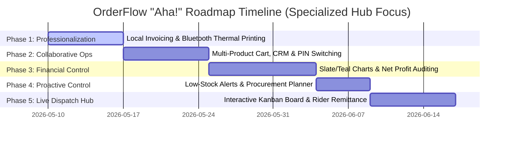
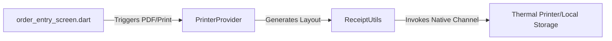
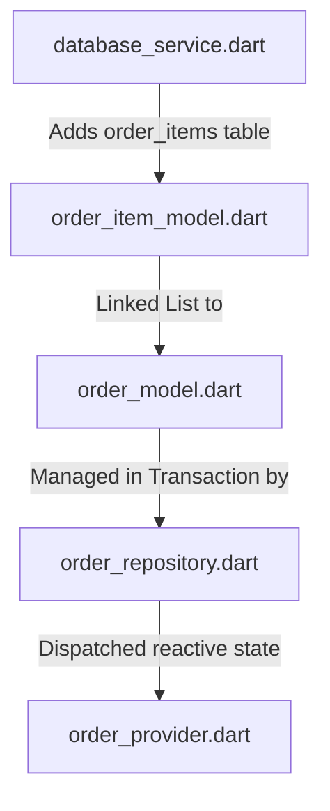
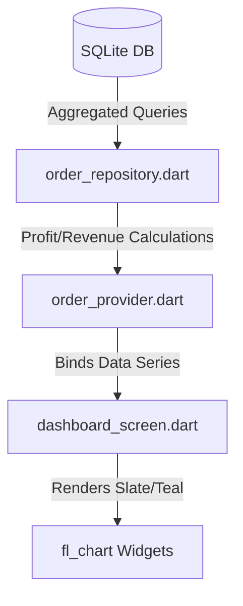
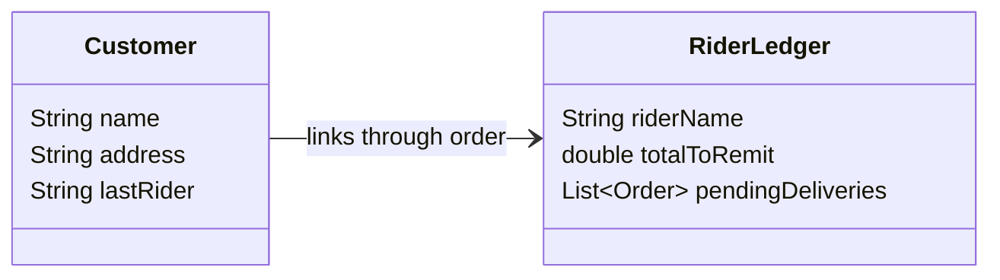

# 🚀 OrderFlow Milestone Roadmap: Reaching the "Aha!" Moment

To transform **OrderFlow** from a functional local utility into a premium, indispensable desk application that merchants love and share, we need to design features that elicit an immediate **"Aha!" moment**. 

These moments occur when a user sees a painful, time-consuming daily chore disappear in a single click, or when they suddenly see business insights they never had on paper.

### 🎯 Our Target Audience & Core Use Case
Unlike micro-retail "sari-sari" stores that deal with high-frequency, low-value candy/snack sales, **OrderFlow is purpose-built for specialized community hubs run by collaborative teams of 2 to 3 people**. 
* **The Business Profile**: Highly countable, medium-to-high-value day-to-day delivery/order operations (e.g. **LPG Gas/Flame Delivery hubs**, **5-Gallon Water Refilling stations**, **Specialty bakeries**, or **Local community distribution desks**).
* **The Operational Volume**: 10 to 50 structured orders per day.
* **The Operational Structure**: 1 desk operator taking orders, 1 person coordinating stock/packaging, and 1 or 2 riders delivering.

This milestone document details the 5 major feature phases designed to wow these collaborative small teams, mapping them directly to our codebase architecture and specifying technical edge cases.

---



---

## 💎 The Slate/Teal Theme & Design Principles
All features must strictly adhere to the UI tokens defined in [colors.dart](file:///Users/michaeljosephsantos/Desktop/personal-projects/project-2/lib/core/theme/colors.dart) and [style.dart](file:///Users/michaeljosephsantos/Desktop/personal-projects/project-2/lib/core/theme/style.dart):
* **No Bubbly Cards**: Use Swiss micro-radii (`radiusSmall: 4.0`, `radiusMedium: 6.0`, `radiusLarge: 8.0`).
* **Minimalist Lines**: Use 1.0px thin Slate borders (`0xFF334155`) for structure.
* **Premium Color Contrast**: Deep Slate Navy background (`0xFF0F172A`) contrasted with clean Teal accents (`0xFF0D9488`) and Indigo accents (`0xFF6366F1`) for branding highlights.

---

## 📍 Phase 1: Branded Hub Invoicing & Thermal Ticket Printing

> [!NOTE]
> **The "Aha!" Moment**: A customer calls to order an LPG tank. The operator logs it, clicks "Complete & Print", and within 2 seconds, a beautiful physical dispatch ticket prints out from a Bluetooth receipt printer containing the customer's address and the assigned delivery rider. It's instantly handed to the rider to complete the run.

### 🌟 Core Value Add
For small hubs, paper tickets are the physical link between the desk coordinator, the warehouse loader, and the delivery rider. Providing an automated, high-fidelity receipt generator with custom branding details professionalizes operations.

### 🛠️ Architecture & Blueprint Target Files



* **Core Utilities Layer**:
  * Create `lib/core/utils/receipt_generator.dart` to generate styled receipt layouts (80mm/58mm roll widths) containing **Delivery Address**, **Rider Name**, and **Special Delivery Instructions**.
* **State Management Layer**:
  * Create `lib/providers/printer_provider.dart` to handle connection states for local USB or Bluetooth thermal receipt printers.
* **Presentation Layer**:
  * **Target File**: [lib/presentation/screens/order_entry_screen.dart](file:///Users/michaeljosephsantos/Desktop/personal-projects/project-2/lib/presentation/screens/order_entry_screen.dart)
  * **Changes**: Add a sleek **"Print Dispatch Ticket"** button to checkout completion drawers.

### ⚠️ Technical & Operational Edge Cases
* **Printer Disconnect / Loss of Connection Mid-Print**:
  * *Failure*: Native channel throws an exception if the Bluetooth link is broken while streaming layouts.
  * *Resolution*: Catch print exceptions cleanly. Cache the raw printable string in the local state buffer and display an inline Teal/Amber alert banner: `"Printer disconnected. Reconnect & click here to retry"`, preventing the order from having to be re-entered.
* **Sizing Constraints (58mm vs 80mm rolls)**:
  * *Failure*: Layout calculations intended for 80mm rolls wrapping poorly and truncating price columns on smaller 58mm POS receipt paper.
  * *Resolution*: Define responsive column layouts in `receipt_generator.dart`. Create helper functions that compute absolute character counts before wrapping lines. Add a **"Paper Width Toggle"** (58mm / 80mm) in Brand Settings.
* **Offline PDF Storage Bloat**:
  * *Failure*: Continual PDF invoices sharing through system hooks filling up temporary local folders.
  * *Resolution*: Implement safe cleanup routines. Auto-delete any temporary PDF file immediately once the system sharing dialog has closed.

---

## 📍 Phase 2: Multi-Product Shopping Cart, CRM, & Staff PIN Switching

> [!NOTE]
> **The "Aha!" Moment**: A customer orders an LPG tank, a safety regulator hose, and a burner. Instead of logging 3 separate order forms, the operator clicks them to build a **Multi-Product Basket** inside a clean visual cart interface, adjusting quantities on the fly with real-time stock deduction. To repeat a customer's order, they search their name, click `"Repeat Last Order"`, and the entire multi-item basket auto-populates!

### 🌟 Core Value Add
In countable hubs, orders are rarely limited to exactly one single item type. Supporting true **Multi-Product Orders** moves the application from a simple spreadsheet-like transaction log to an enterprise-grade Sales & Inventory system. 

### 🛠️ Architecture & Blueprint Target Files



* **Database Schema Refactoring**:
  * **Target File**: [lib/data/database/database_service.dart](file:///Users/michaeljosephsantos/Desktop/personal-projects/project-2/lib/data/database/database_service.dart)
  * **Changes**: Create a new `order_items` table to support **1-to-Many** relationship constraints:
    ```sql
    CREATE TABLE order_items (
      id INTEGER PRIMARY KEY AUTOINCREMENT,
      order_id INTEGER NOT NULL,
      product_id INTEGER NOT NULL,
      quantity INTEGER NOT NULL,
      unit_price REAL NOT NULL,
      computed_price REAL NOT NULL,
      FOREIGN KEY (order_id) REFERENCES orders (id) ON DELETE CASCADE,
      FOREIGN KEY (product_id) REFERENCES products (id) ON DELETE RESTRICT
    );
    ```
    *Remove the single product_id and quantity references from the master `orders` table.*
* **Data Layer (Models & Repositories)**:
  * Create `lib/data/models/order_item_model.dart` to represent nested basket items.
  * **Target File**: [lib/data/models/order_model.dart](file:///Users/michaeljosephsantos/Desktop/personal-projects/project-2/lib/data/models/order_model.dart)
  * **Changes**: Re-architect `OrderModel` to contain a child list: `List<OrderItemModel> items`.
  * **Target File**: [lib/data/repository/order_repository.dart](file:///Users/michaeljosephsantos/Desktop/personal-projects/project-2/lib/data/repository/order_repository.dart)
  * **Changes**: Modify order insertion to execute as a single SQL transaction: (1) insert parent `orders` record and grab autoincrement ID, (2) loop and insert children `order_items` records, (3) execute bulk inventory stock deductions.
* **State Management Layer**:
  * **Target File**: [lib/providers/order_provider.dart](file:///Users/michaeljosephsantos/Desktop/personal-projects/project-2/lib/providers/order_provider.dart)
  * **Changes**: Add a `List<OrderItemModel> _cartDraft` list to manage the temporary visual shopping cart before checkout commits.
* **Presentation Layer**:
  * **Target File**: [lib/presentation/screens/order_entry_screen.dart](file:///Users/michaeljosephsantos/Desktop/personal-projects/project-2/lib/presentation/screens/order_entry_screen.dart)
  * **Changes**: Re-design the UI to show a beautiful left-hand product catalog grid and a right-hand **Cart Drawer** calculating unit prices, individual totals, and grand computed price in real-time.

### ⚠️ Technical & Operational Edge Cases
* **Transactional Rollback on Stockout during Multi-Product checkout**:
  * *Failure*: Attempting to place a 3-item order, but the 3rd item's inventory is depleted mid-transaction, causing partial database insertions and mismatched data.
  * *Resolution*: Wrap the entire multi-insert process inside an SQLite transaction block. If any single item's stock check fails, throw an exception to trigger an absolute database rollback, displaying a custom error banner: `"Fulfillment failed: Hose is out of stock"`.
* **Multi-Product Restocking on Cancel**:
  * *Failure*: Cancelling a multi-product order fails to loop through all nested items, leading to incomplete inventory restocking.
  * *Resolution*: Ensure `changeOrderStatus` queries the `order_items` table first, fetching all linked products, and executes a looped inventory restoration transaction.
* **Stale Product Pricing on Re-ordering**:
  * *Failure*: Repeating a customer's historical order containing obsolete prices, resulting in checkout calculations mapping to old pricing values.
  * *Resolution*: Cross-validate historical item prices with current database pricing before auto-populating. Show an amber warning badge if any item price has been updated since their last run.

---

## 📍 Phase 3: High-Value Net Profit Auditing & Slate/Teal Charts

> [!NOTE]
> **The "Aha!" Moment**: At the end of the week, the owner opens the dashboard. Instead of seeing a simple raw list of sales, they see an elegant interactive chart showing a clean breakout of **Actual Net Margin Profit** (Revenue minus Product Unit Costs) and top categories. They see exactly which items are making their hub rich.

### 🌟 Core Value Add
In high-value countable commerce (like LPG delivery where unit costs are high), raw revenue is a deceptive metric. Tracking precise net margins (`selling_price - unit_cost`) gives the 2-3 person team clear visual guidance on their actual business health.

### 🛠️ Architecture & Blueprint Target Files



* **Data Layer (Repositories)**:
  * **Target File**: [lib/data/repository/order_repository.dart](file:///Users/michaeljosephsantos/Desktop/personal-projects/project-2/lib/data/repository/order_repository.dart)
  * **Changes**: Expose a complex aggregate query joining products and orders:
    ```sql
    SELECT SUM(oi.computed_price - (p.unit_cost * oi.quantity)) AS net_profit
    FROM order_items oi
    JOIN products p ON oi.product_id = p.id
    JOIN orders o ON oi.order_id = o.id
    WHERE o.status = 'COMPLETED';
    ```
* **Presentation Layer**:
  * **Target File**: [lib/presentation/screens/dashboard_screen.dart](file:///Users/michaeljosephsantos/Desktop/personal-projects/project-2/lib/presentation/screens/dashboard_screen.dart)
  * **Changes**: Re-architect dashboard cards with high-fidelity charts using `fl_chart`. Include smooth tooltips, custom grids, and interactive period selectors (Today / Week / Month).

### ⚠️ Technical & Operational Edge Cases
* **Negative Profit Margins (Loss Sales)**:
  * *Failure*: Selling price configured lower than unit cost (e.g. promotional items or mistakes) resulting in negative values that crash canvas chart coordinate calculations.
  * *Resolution*: Implement responsive y-axis mapping on line charts. If net values drop below zero, render negative coordinate regions utilizing Slate-Red (`0xFFEF4444`) gradient tints safely.
* **Empty Database Sales States**:
  * *Failure*: Zero-sales records on initial boot causing division-by-zero or empty data arrays that trigger index exceptions on `fl_chart` painters.
  * *Resolution*: Enforce strict null-safety wrappers on getters. If dataset is empty, render a stunning, customized glass-card outline chart: `"No orders registered yet. Charts will plot your progress automatically"`.
* **High-Cardinality Sales Legends**:
  * *Failure*: Pie charts attempting to display 50+ individual colored sectors for 50 distinct items, resulting in an unreadable blob of colors and text labels.
  * *Resolution*: Create a grouping algorithm in the repository layer. Fetch the **Top 5** selling products individually, and aggregate the remaining sales records under a single unified **"Others"** slice.

---

## 📍 Phase 4: Main Asset Alerts & Supplier Procurement Planner

> [!NOTE]
> **The "Aha!" Moment**: With only 3 full LPG tanks left in the shop, a soft Amber banner lights up on the coordinator's desk panel: *"LPG Tanks reaching critical stock (3 left)"*. The app compiles a **Procurement List** containing the supplier details and expected unit purchase costs, allowing the team to call in a restock order with a single click.

### 🌟 Core Value Add
In countable hubs, stockouts are fatal. Having a smart system that monitors product counts on every checkout transaction, raising real-time warnings, and aggregates low-stock products into a beautiful "Procurement Planning" card makes inventory management feel proactive.

### 🛠️ Architecture & Blueprint Target Files

* **Data Layer (Models)**:
  * **Target File**: [lib/data/models/product_model.dart](file:///Users/michaeljosephsantos/Desktop/personal-projects/project-2/lib/data/models/product_model.dart)
  * **Changes**: Add a `reorderLevel` variable (defaulting to e.g., 5 units) so that threshold-based warnings are personalized per-product.
* **State Management Layer**:
  * **Target File**: [lib/providers/product_provider.dart](file:///Users/michaeljosephsantos/Desktop/personal-projects/project-2/lib/providers/product_provider.dart)
  * **Changes**: Expose a computed getter list `List<ProductModel> get lowStockProducts` which filters items where `quantity <= reorderLevel`.
* **Presentation Layer**:
  * **Target File**: [lib/presentation/screens/products_list_screen.dart](file:///Users/michaeljosephsantos/Desktop/personal-projects/project-2/lib/presentation/screens/products_list_screen.dart)
  * **Changes**: Add a custom **Low Stock Summary Widget** styled with soft Amber/Red glass aesthetics. Introduce a "Generate Supplier Reorder Checklist" button that compiles low-stock items into an exportable text format.

### ⚠️ Technical & Operational Edge Cases
* **Negative Quantities (Over-sales / Pre-sales)**:
  * *Failure*: Allowing backorders or over-selling items driving stock quantities below zero, displaying awkward negative inventory listings.
  * *Resolution*: Render negative stock as an explicitly styled, high-contrast red warning badge: `[Out of Stock: -4]`. Automatically pin these items to the very top of the Restocking Ledger.
* **Overwhelming Alert Fatigue**:
  * *Failure*: Repeatedly launching distracting modal popups and interrupting rapid-fire checkouts when multiple products cross low-stock thresholds.
  * *Resolution*: Restrict low-stock notifications to subtle, non-intrusive bottom-left snackbars. Aggregate all warnings into a unified notification tray or active badge on the glass navigation sidebar.

---

## 📍 Phase 5: Live Dispatch Kanban Board & Rider Remittance Ledger

> [!NOTE]
> **The "Aha!" Moment**: The 2-3 person team coordinates deliveries on a single screen. They see three columns: **PENDING** (Orders taken), **DISPATCHED** (Riders out on runs), and **DELIVERED** (Riders returned). With one tap, they drag-and-drop a ticket or change statuses. When rider "Kuya Edwin" returns, they click his name and instantly see exactly how many deliveries he completed, his total tips, and cash to remit!

### 🌟 Core Value Add
In structured delivery operations, tracking active order states and settling cash collections with riders is the main operational loop. This live board keeps the 2-3 person team in perfect harmony, replacing complex whiteboard scribbles.

### 🛠️ Architecture & Blueprint Target Files



* **State Management Layer**:
  * **Target File**: [lib/providers/order_provider.dart](file:///Users/michaeljosephsantos/Desktop/personal-projects/project-2/lib/providers/order_provider.dart)
  * **Changes**: Expose helper methods to aggregate orders by status (`PENDING`, `DISPATCHED`, `COMPLETED`) and rider. Add actions to "Settle/Remit Rider Cash" in bulk.
* **Presentation Layer**:
  * **New Screen**: Create `lib/presentation/screens/rider_ledger_screen.dart` to show a list of active riders, their pending deliveries, and remitted collections.
  * **Target File**: [lib/presentation/screens/orders_list_screen.dart](file:///Users/michaeljosephsantos/Desktop/personal-projects/project-2/lib/presentation/screens/orders_list_screen.dart)
  * **Changes**: Build a beautiful, responsive, and minimalist **Kanban Dispatch Board** using flat Slate columns, allowing instant order status toggles with smooth transitions.

### ⚠️ Technical & Operational Edge Cases
* **Duplicate Customer Names (Name Collisions)**:
  * *Failure*: Two customers named "Michael Santos" located in different neighborhoods auto-completing incorrectly and swapping addresses.
  * *Resolution*: Enhance autocomplete search suggestions to display details: `"Michael Santos (Cubao)"` vs `"Michael Santos (Marikina)"`. Cache addresses as distinctive string pairings inside the local lookup table.
* **Rider Deletion or Renaming**:
  * *Failure*: A delivery rider leaving or changing names throwing SQL foreign-key constraint violations or causing null rendering in the historic orders list.
  * *Resolution*: Do not enforce hard foreign keys on the rider field since they aren't fully separate tables. Treat `delivery_rider` as a nullable VARCHAR. On rider deletion, fallback to `"Unassigned Rider"` gracefully in all views.
* **Remittance Audit Ledger Sync**:
  * *Failure*: Setting a rider's collected cash status to "Remitted" changing or messing up actual revenue accounting dates or historic sales tallies.
  * *Resolution*: Separate cash reconciliation from transaction fulfillment statuses. Maintain a clear binary status field: `remittance_status` (`'PENDING'` vs `'SETTLED'`) in the order schema to preserve the historical integrity of accounting metrics.

---

## 🏁 Summary of Target Impacts & Edge Cases

| Phase | Feature Name | Primary Impact | "Aha!" Trigger | ⚠️ Primary Edge Case |
| :---: | :--- | :--- | :--- | :--- |
| **1** | **Hub Invoicing & POS Tickets** | Operational Hand-off | Immediate physical printout containing addresses and instructions | **Bluetooth Link Drop**: Cache byte stream in provider and show click-to-retry bar |
| **2** | **Multi-Product Shopping Cart** | Coordination Speed | Repeat complex multi-item baskets in 2 clicks; 1-second staff switching | **Transactional Rollback**: Wrap bulk SQL inserts in SQLite transaction; revert completely if any item is out of stock |
| **3** | **Interactive Net Profit Charts** | Financial Control | Direct visual calculation of actual profit margins (`selling - unit`) | **Negative Margins**: Plot negative coordinates cleanly in Slate-Red accents |
| **4** | **Reorder Alerts & Planner** | Stock Security | Banners for main asset depletion and exportable supplier checklists | **Over-Sales (Negative Stock)**: Auto-pin negative warning pills on restocking panel |
| **5** | **Live Dispatch Board & Remittance** | Operations Control | 1-click order state tracking & rapid rider collection settlement | **Rider Deletion Cascade**: Treat rider as loose VARCHAR, falling back to "Unassigned" |

By focusing development sprints on these strategic high-value integrations, we target intense real-world business pains with high design fidelity, creating the ultimate desktop software for offline retail operations.
