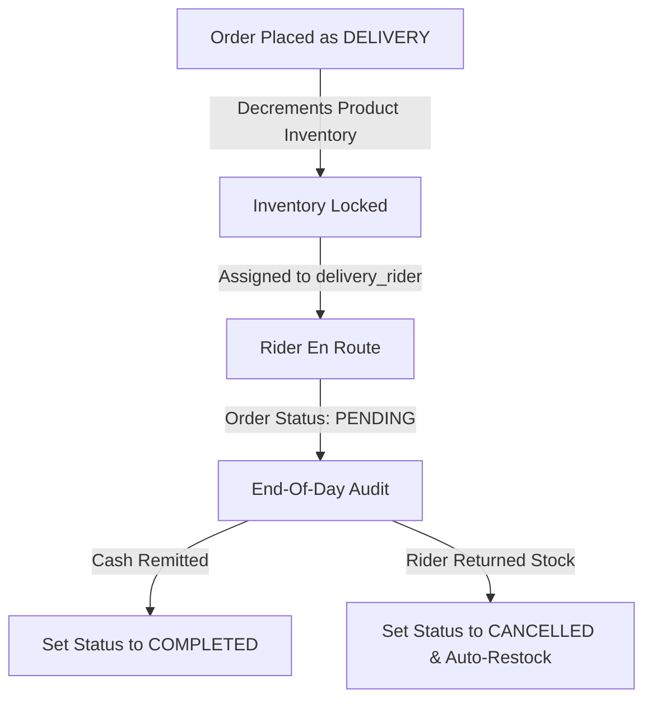

# Q&A: Rider Remittance Leakage & Local Last-Mile Delivery Businesses

This document explores how the OrderFlow offline ledger system solves the rider remittance leakage problem for last-mile delivery businesses, and examines similar local businesses that benefit from this design.

---

## 1. The Core Problem: Manual Ledgering & Rider Leakage

In local community commerce (especially in emerging markets like the Philippines), many businesses operate a "central hub, local delivery" model.
* **Operational Flow**: A customer orders via SMS/phone/social media. A dispatch operator prepares the items, logs them manually, and hands them to a delivery rider (often on a motorcycle or tricycle) who delivers the items and collects cash-on-delivery (COD).
* **Rider Leakage**: Without a rigid digital system, riders sometimes fail to remit the correct payment. They may claim:
  1. The customer was not home (but actually delivered it and kept the cash).
  2. The customer requested a discount or paid less.
  3. The paper receipt/ledger sheet was lost or smudged.
  4. The inventory was damaged, lost, or stolen en route.

Because manual paper ledgers are easily lost, altered, or lacked cross-referencing with live inventory counts, store managers struggle to enforce strict accountability.

---

## 2. Other Businesses That Face the Same Challenge

The LPG (Liquefied Petroleum Gas) cylinder delivery business is a prime example of this model (high-value transactions, heavy logistics, and direct cash collections). However, several other local businesses operate with the exact same structure and can be immediately onboarded onto **OrderFlow**:

| Business Type | Deliverables | Collection & Leakage Risk | How OrderFlow Helps |
| :--- | :--- | :--- | :--- |
| **Water Refilling Stations** | Slim/Round 5-gallon water containers | Low per-unit cost but high volume. Riders can deliver 20 gallons, report 15, and pocket the rest, or fail to track returned empty gallons. | Logs fulfillment type as `DELIVERY` with a named `delivery_rider`. Tracks both refills as products, matching rider stock to cash collected. |
| **Ice Block / Tube Ice Distributors** | 10kg - 50kg bags or blocks of ice | Sold early morning to wet markets, cafes, and bars on COD. Invoices are prone to smudging due to ice melt; cash amounts can be easily skimmed. | Replaces wet paper receipts with an offline digital ledger. Lock in prices beforehand; riders cannot claim they "sold it for cheaper." |
| **B2B Bakery & Confectionery Delivery** | Packs of bread, pastries, and buns | Delivered daily to local convenience ("sari-sari") stores. High inventory turnaround and complex consignment/credit terms. | Compiles sales transactions per route. Restocking cancellation safety automatically handles returns/expired stock. |
| **Hardware & Building Supplies** | Cement bags, bricks, steel rods, sand | Delivered via local light trucks on COD. High-value transactions where drivers handle large cash payments. | Stores recipient names, exact addresses, and driver logs. Auto-computes delivery totals so drivers have no room for manual calculation errors. |
| **Fresh Farm/Wet Market Produce Suppliers** | Pork, chicken, seafood, vegetables | Highly volatile weight-based prices delivered directly to local restaurants at dawn. Cash or short-term credit. | Serializes and locks custom product traits, computes prices instantly, and assigns a specific driver/delivery rider for remittance tracking. |
| **Cosmetics / Clothing Direct Sales Networks** | Tupperware, beauty products, garments | Agents take physical inventory bags and sell door-to-door, remitting payments weekly. | Agents are listed as `delivery_rider` (or Sales Agent). Provides real-time visibility into who is holding how much active stock or pending cash. |

---

## 3. How OrderFlow's Architecture Solves Rider Leakage

OrderFlow's database schema and state providers are uniquely built to shut down rider leakage via a 4-step digital auditing loop:



### A. The Ledger Database Audit (`orders` Table)
Our `orders` table tracks critical metadata:
```sql
CREATE TABLE orders (
  id INTEGER PRIMARY KEY AUTOINCREMENT,
  customer_name TEXT NOT NULL,
  customer_address TEXT NOT NULL,
  product_id INTEGER NOT NULL,
  quantity INTEGER NOT NULL,
  computed_price REAL NOT NULL,           -- Computed: quantity * product.selling_price
  fulfillment_type TEXT NOT NULL,         -- 'DELIVERY' or 'WALKIN'
  delivery_rider TEXT,                    -- Optional string (e.g. 'John Doe')
  status TEXT NOT NULL DEFAULT 'PENDING',  -- 'PENDING', 'COMPLETED', 'CANCELLED'
  created_at TEXT NOT NULL,
  FOREIGN KEY (product_id) REFERENCES products (id) ON DELETE RESTRICT
);
```

### B. End-of-Day Remittance Verification
Because the app calculates the `computed_price` mathematically behind the scenes (`quantity * selling_price`), riders cannot claim they sold an item for a lower rate. 
At the end of the shift, the merchant desk runs a quick reconciliation for each rider (e.g., "Rider John"):
* **Expected Remittance**: `SELECT SUM(computed_price) FROM orders WHERE delivery_rider = 'John' AND fulfillment_type = 'DELIVERY' AND status = 'PENDING'`
* **Rule**: The rider must present either the exact cash amount or return the unsold inventory.

### C. Inventory Control (The Stock-Lock Guard)
When an order is created, inventory is automatically decremented from the `products` catalog. If a rider returns claims that a customer canceled or was unavailable:
1. The operator updates the order's status to `CANCELLED`.
2. The transaction triggers a database-level `RESTOCK` operation in `order_repository.dart`.
3. This adds the product quantity back into the system, which is only approved once the operator physically verifies that the rider returned the undelivered LPG tank/water gallon to the warehouse shelf.

### D. Offline-First Resilience
In remote fields or towns with weak mobile connectivity, cloud-based delivery systems often fail or disconnect. OrderFlow's **100% self-contained SQLite DB** guarantees that the merchant desk can continuously check out riders, track inventory, and record payments offline without losing a single cent or transaction log.
