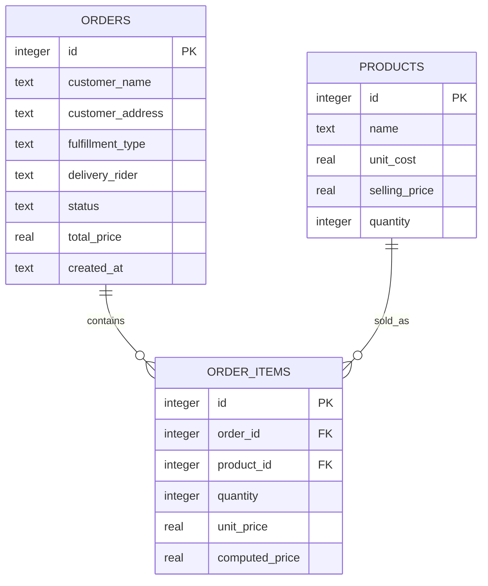

# Q&A: Scaling OrderFlow for 100+ Products & Multi-Product Orders

This document provides a highly structured engineering and implementation plan to scale **OrderFlow** from a single-product order ledger into a multi-product POS and rider-reconciliation powerhouse capable of handling a catalog of 100+ items and complex multi-item checkouts.

---

## 1. Architectural Scaling Analysis

Currently, OrderFlow is optimized for quick single-item orders (e.g. 1 LPG gas tank or 1 water refill). 
To support customers ordering **multiple products at once** with a large catalog of **100+ items**, we must solve three key bottlenecks:

1. **Database Schema Limitation**: The current `orders` table contains a direct `product_id` and `quantity` columns, which enforces a 1:1 order-to-product limit. We must decouple this into a **1-to-Many relationship** (`orders` and `order_items`).
2. **UI Search Performance**: Browsing 100+ products via standard scrolling becomes tedious. We need a dual-pane **Searchable Catalog + Shopping Cart Drawer** UI.
3. **Stock Verification & Locking**: High-volume checkouts with multiple items need atomic transactional safety. We must ensure that either *all* items in the cart are successfully reserved, or the transaction fails cleanly (ACID compliance) to prevent stock mismatches.

---

## 2. Part 1: Schema Normalization & Safe SQLite Migration (v3)

We will increase our database schema version from `2` to `3` in [database_service.dart](file:///Users/michaeljosephsantos/Desktop/personal-projects/project-2/lib/data/database/database_service.dart).

### The Database Schema Transition


### v3 Migration SQL scripts
During the migration inside `_onUpgrade()`:
1. **Create the `order_items` table**:
   ```sql
   CREATE TABLE order_items (
     id INTEGER PRIMARY KEY AUTOINCREMENT,
     order_id INTEGER NOT NULL,
     product_id INTEGER NOT NULL,
     quantity INTEGER NOT NULL,
     unit_price REAL NOT NULL,
     computed_price REAL NOT NULL,
     FOREIGN KEY (order_id) REFERENCES orders (id) ON DELETE CASCADE,
     FOREIGN KEY (product_id) REFERENCES products (id) ON DELETE RESTRICT
   );
   ```
2. **Add `total_price` to `orders`**:
   ```sql
   ALTER TABLE orders ADD COLUMN total_price REAL NOT NULL DEFAULT 0.0;
   ```
3. **Run Data Migration (Backward Compatibility)**:
   Extract any existing single-item logs and safely seed them into the new table so that the user does not lose historical transaction data:
   ```sql
   -- Seed existing order data into order_items
   INSERT INTO order_items (order_id, product_id, quantity, unit_price, computed_price)
   SELECT id, product_id, quantity, (computed_price / quantity), computed_price FROM orders;

   -- Populate the new total_price column in orders
   UPDATE orders SET total_price = computed_price;
   ```
4. **Index additions for speed scaling**:
   ```sql
   CREATE INDEX IF NOT EXISTS idx_order_items_order_id ON order_items (order_id);
   CREATE INDEX IF NOT EXISTS idx_products_name ON products (name);
   ```

---

## 3. Part 2: Domain Layer & Repository Refactoring

### A. New Model: `OrderItemModel`
Create a clean file `lib/data/models/order_item_model.dart`:
```dart
class OrderItemModel {
  final int? id;
  final int? orderId;
  final int productId;
  final int quantity;
  final double unitPrice;       // snapshot of price at checkout
  final double computedPrice;   // quantity * unitPrice
  final String? productName;    // Joined helper field

  OrderItemModel({
    this.id,
    this.orderId,
    required this.productId,
    required this.quantity,
    required this.unitPrice,
    required this.computedPrice,
    this.productName,
  });

  Map<String, dynamic> toMap() => {
    if (id != null) 'id': id,
    if (orderId != null) 'order_id': orderId,
    'product_id': productId,
    'quantity': quantity,
    'unit_price': unitPrice,
    'computed_price': computedPrice,
  };

  factory OrderItemModel.fromMap(Map<String, dynamic> map) => OrderItemModel(
    id: map['id'] as int?,
    orderId: map['order_id'] as int?,
    productId: map['product_id'] as int,
    quantity: map['quantity'] as int,
    unitPrice: (map['unit_price'] as num).toDouble(),
    computedPrice: (map['computed_price'] as num).toDouble(),
    productName: map['product_name'] as String?,
  );
}
```

### B. Refactoring `OrderModel`
Rewrite `lib/data/models/order_model.dart` to hold a dynamic list of items:
```dart
class OrderModel {
  final int? id;
  final String customerName;
  final String customerAddress;
  final String fulfillmentType;
  final String? deliveryRider;
  final String status;
  final double totalPrice;
  final String createdAt;
  final List<OrderItemModel> items; // Decoupled items list

  OrderModel({
    this.id,
    required this.customerName,
    required this.customerAddress,
    required this.fulfillmentType,
    this.deliveryRider,
    this.status = 'PENDING',
    required this.totalPrice,
    required this.createdAt,
    required this.items,
  });
}
```

### C. Atomic Transaction logic in `OrderRepository`
When writing the multi-product checkout inside `order_repository.dart`, we MUST wrap everything inside a strict database **transaction** to guarantee consistency:
```dart
Future<int> placeMultiProductOrder(OrderModel order) async {
  final db = await _dbService.database;
  return await db.transaction((txn) async {
    // 1. Double check stock for ALL products inside the cart first
    for (var item in order.items) {
      final res = await txn.query('products', where: 'id = ?', whereArgs: [item.productId]);
      if (res.isEmpty) throw Exception("Product matching ID ${item.productId} was not found.");
      final currentQuantity = res.first['quantity'] as int;
      if (currentQuantity < item.quantity) {
        throw Exception("Insufficient stock for product: ${res.first['name']}. Available: $currentQuantity, Requested: ${item.quantity}");
      }
    }

    // 2. Insert main Order header
    final orderId = await txn.insert('orders', {
      'customer_name': order.customerName,
      'customer_address': order.customerAddress,
      'fulfillment_type': order.fulfillmentType,
      'delivery_rider': order.deliveryRider,
      'status': order.status,
      'total_price': order.totalPrice,
      'created_at': order.createdAt,
    });

    // 3. Insert all line items & decrement corresponding product quantities
    for (var item in order.items) {
      await txn.insert('order_items', item.toMap()..['order_id'] = orderId);
      await txn.execute(
        'UPDATE products SET quantity = quantity - ? WHERE id = ?',
        [item.quantity, item.productId]
      );
    }
    return orderId;
  });
}
```

---

## 4. Part 3: State Management Adaptations (`OrderProvider`)

In `lib/providers/order_provider.dart`, we will manage a cart state inside our Point-Of-Sale (POS) interface:
* `Map<int, int> _cartItems = {}` (Mapping `productId` -> `quantitySelected`).
* `addToCart(int productId)` & `removeFromCart(int productId)`.
* `updateCartQuantity(int productId, int quantity)`.
* `checkoutCart(String customerName, String customerAddress, String fulfillmentType, String? rider)`.

---

## 5. Part 4: High-End POS UI Redesign

To accommodate a premium, fast workflow for 100+ items, the current single-form view on `order_entry_screen.dart` is upgraded into a **Split-Screen Desktop Desk POS**:

```
┌────────────────────────────────────────────────────────┐┌────────────────────┐
│ Search Catalog: [ Search product... (Debounced)     ]  ││ Shopping Cart      │
├────────────────────────────────────────────────────────┤│                    │
│ [🟢 Category Filter Tabs: Gas | Accessories | Water ]  ││ LPG Tank x 2       │
├────────────────────────────────────────────────────────┤│  (₱1,100 ea)       │
│ ┌───────────────────────┐  ┌───────────────────────┐   ││                    │
│ │ Flame Guard XL        │  │ Regulator Hose        │   ││ Water Refill x 5   │
│ │ Stock: 42             │  │ Stock: 15             │   ││  (₱40 ea)          │
│ │ ₱1,100    [+ Add]     │  │ ₱250      [+ Add]     │   │├────────────────────┤
│ └───────────────────────┘  └───────────────────────┘   ││ Deliver To:        │
│ ┌───────────────────────┐  ┌───────────────────────┐   ││ [ Customer Name ] │
│ │ LPG Cylinder 11kg     │  │ Valve Adapter         │   ││                    │
│ │ Stock: 9              │  │ Stock: 110            │   ││ Rider Assigned:    │
│ │ ₱980      [+ Add]     │  │ ₱150      [+ Add]     │   ││ [ Rider John    ▼ ]│
│ └───────────────────────┘  └───────────────────────┘   │├────────────────────┤
│                                                        ││ Total:  ₱2,400.00  │
│ [◄ Page 1 of 5 ►]                                      ││ [ Place Order 💳 ] │
└────────────────────────────────────────────────────────┘└────────────────────┘
```

### High-Fidelity UX Additions:
1. **Interactive Debounced Search Bar**: Avoids rebuilding the catalog grid on every single keystroke. Uses a 200ms debounce interval for seamless, rapid catalog searching.
2. **Category Tabs**: Fluid animated tabs to quickly jump between categories (e.g., Cooking Gas, Accessories, Water Gallons, Plumbing).
3. **Optimistic Stock Alerts**: Clicking `Add` instantly increments the cart counter, checking visual stock in real-time. If the cart request reaches actual inventory limits, the button changes to a disabled `MAX OUT` state with a subtle red border.

---

## 6. Phase-by-Phase Roadmap

* [ ] **Phase 1: DB & Model Migrations**
  * Increase DB version to 3, implement `order_items` schema and `_onUpgrade` migration script.
  * Create `OrderItemModel` and refactor `OrderModel`.
* [ ] **Phase 2: Repository Transactions**
  * Refactor `OrderRepository` to use transactional SQLite queries for checkouts.
  * Update order detail joins to fetch both header and list items correctly.
* [ ] **Phase 3: POS Provider (Cart)**
  * Introduce checkout cart reactive states inside `OrderProvider`.
  * Ensure automatic stock reservation and cancellation restocks work cohesively.
* [ ] **Phase 4: Responsive Split UI**
  * Redesign `order_entry_screen.dart` using a beautiful split-screen (65% searchable catalog grid + 35% cart controller).
  * Build dynamic inventory indicator pills for each item card.
* [ ] **Phase 5: Reconciliation Testing**
  * Validate that end-of-day rider remittance balances function smoothly with multi-product order queries.
